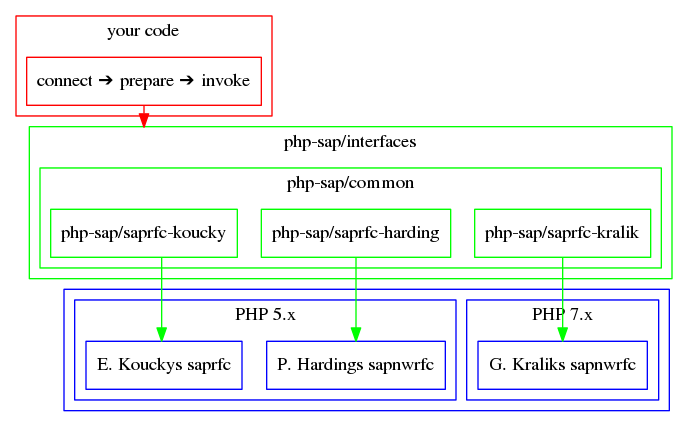

## About PHP/SAP

PHP/SAP defines a layer of abstraction between actual SAP remote function calls
 and your PHP-Code. As to why this project has been created and which goals it
 wants to achieve, you can read the [motivation](motivation).

[](res/php-sap.svg)

The interfaces define a common denominator on how to configure a
 connection to SAP, prepare a SAP remote function call, and invoke a SAP remote
 function call.

The common classes and exceptions add logic that is not specific to
 the underlying PHP module.

The module specific implementations contain code that is specific to [the
 underlying PHP-module](php-modules).

## TL;DR

Especially short explanation for people in a hurry.

Use `composer require` to add PHP/SAP to your project. Depending on the
 [PHP module](php-modules) you need to require a certain PHP/SAP package.
 
`composer require php-sap/saprfc-koucky`   
or   
`composer require php-sap/saprfc-harding`   
or   
`composer require php-sap/saprfc-kralik`

```php
<?php
//Include the composer autoloader ...
require_once 'vendor/autoload.php';
//... and add the namespaces of the classes used.
use phpsap\classes\Config\ConfigTypeA;
use phpsap\DateTime\SapDateTime;
use phpsap\saprfc\SapRfc;
/**
 * Create an instance of the SAP remote function using its
 * name, input parameters, and connection configuration.
 *
 * The imaginary SAP remote function requires a
 * date as input and will return a date as output.
 *
 * In this case the configuration array is defined manually.
 */
$result = (new SapRfc(
  'MY_COOL_SAP_REMOTE_FUNCTION',
  [
      'IV_DATE' => (new DateTime('2019-12-31'))
                   ->format(SapDateTime::SAP_DATE)
  ],
  new ConfigTypeA([
      ConfigTypeA::JSON_ASHOST => 'sap.example.com',
      ConfigTypeA::JSON_SYSNR  => '999',
      ConfigTypeA::JSON_CLIENT => '001',
      ConfigTypeA::JSON_USER   => 'username',
      ConfigTypeA::JSON_PASSWD => 'password'
  ])
))->invoke();
//The output array contains a DateTime object.
echo $result['OV_DATE']->format('Y-m-d') . PHP_EOL;
```

Too short? Confused? You should probably read the documentation. 😉

## Documentation

* [Usage overview](usage)
    - [Configure a connection](saprfc-config)
    - [Configure the SAP remote function call](saprfc-function)
* [DateTime conversions for SAP](datetime)

[koucky]: http://saprfc.sourceforge.net/ "SAPRFC extension module for PHP"
[harding]: https://github.com/piersharding/php-sapnwrfc "SAP RFC Connector using the SAP NW RFC SDK for PHP"
[kralik]: https://github.com/gkralik/php7-sapnwrfc "SAP NW RFC SDK extension for PHP7"
