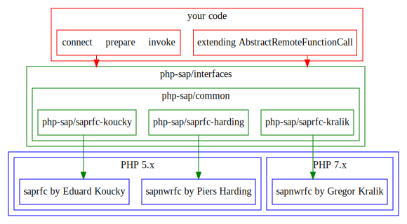

**ATTENTION: THIS IS WORK IN PROGRESS AND NOT TO BE USED UNTIL THIS MESSAGE
 DISAPPEARS!**

## About PHP/SAP

PHP/SAP defines a layer of abstraction between actual SAP remote function calls
 and your PHP-Code. As to why this project has been created and which goals it
 wants to achieve, you can read the [motivation](motivation).

The [interfaces](interfaces) define a common denominator on how to configure a
 connection to SAP, prepare a SAP remote function call, and invoke a SAP remote
 function call.

The [common classes and exceptions](common) add logic that is not specific to
 the underlying PHP module.

The module specific implementations contain code that is specific to [the
 underlying PHP-module](php-modules).

## Usage documentation

* [Usage overview](usage)
    - [Configure a connection](saprfc-config)
    - [Establish a connection](saprfc-connection)
    - [Invoke a function call](saprfc-function)
