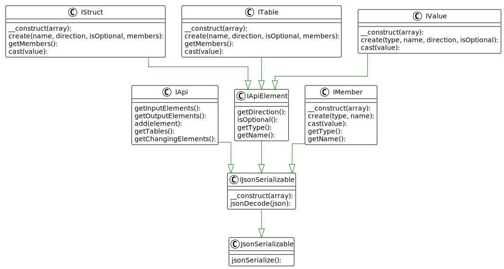

## API

* The `IApi` interfaces manages the elements of the remote function.
* `IApiElement` defines an element of an API with attributes all elements have in common: name, type, direction, and optional-flag.
* `IValue`, `IStruct`, and `ITable` all add a `cast()` method for typecasting.
* `IStruct` and `ITable` contain a list of `IMember` members.
* `IMember` is a member of `IStruct` or `ITable` and only has name and type attributes.

---

[Go back to the interfaces overview](interfaces)
