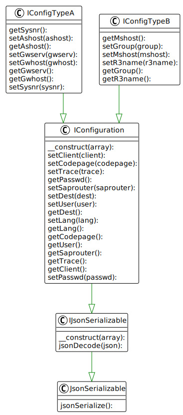

## Configuration

* `IConfiguration` Defines methods for configuration management and (un)serialization. It configures connection parameters, that are common to both connection types (A, and B).
* `IConfigA` Configure connection parameters for SAP remote function calls using a specific SAP application server (type A).
* `IConfigB` Configure connection parameters for SAP remote function calls using load balancing (type B).

---

[Go back to the interfaces overview](interfaces)
