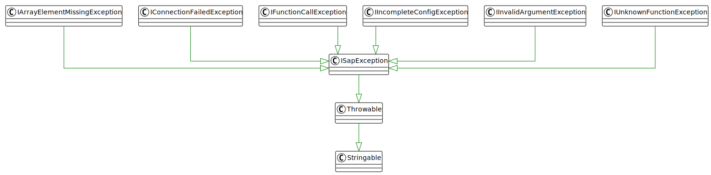

## Exceptions

* `ISapException` A generic parent exception in order to catch SAP remote function call exceptions in general.
* `IArrayElementMissingException` In case the API description of the SAP remote function call defines a member element in an `IArray` that is not present in the given data.
* `IConfigKeyNotFoundException` In case a requested configuration key is missing.
* `IConnectionFailedException` The connection to the remote SAP system failed.
* `IFunctionCallException` In case the SAP remote function call failed for some reason.
* `IIncompleteConfigException` The connection configuration doesn't contain all the necessary parameters.
* `IUnknownFunctionException` The SAP remote function cannot be found using the given connection parameters.

---

[Go back to the interfaces overview](interfaces)
