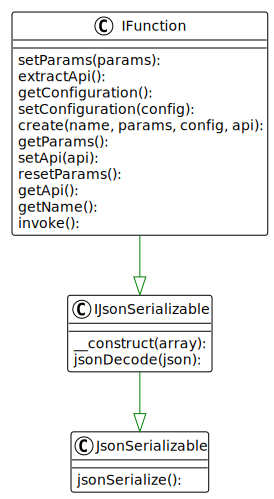

## Function

There are three ways to create a function instance:

1. Factory method: `create()` which takes all necessary information via its parameters.
2. Decoding a formerly JSON encoded function instance using `jsonDecode()`.
3. The constructor accepts an associative array created from `json_decode()` of a formerly JSON encoded function instance.

* The `IFunction` interface defines how functions are handled:
  * `create()` is a factory method creating a function instance.
  * `extractApi()` queries the SAP remote function for its API circumventing the internal cache.
  * `getApi()` returns the API of the SAP remote function and caches the result.
  * `getConfiguration()` returns the configuration used to connect to the SAP system.
  * `getName()` the SAP remote function name.
  * `getParams()` returns an array of SAP remote function call parameters set by `setParams()`.
  * `invoke()` invokes the SAP remote function call and returns its result.
  * `resetParams()` removes any SAP remote function call parameters set by `setParams()`.
  * `setApi()` manually sets the API of the SAP remote function.
  * `setConfiguration()` sets the configuration used to connect to the SAP system.
  * `setParams()` sets an array of SAP remote function call parameters.

---

[Go back to the interfaces overview](interfaces)
